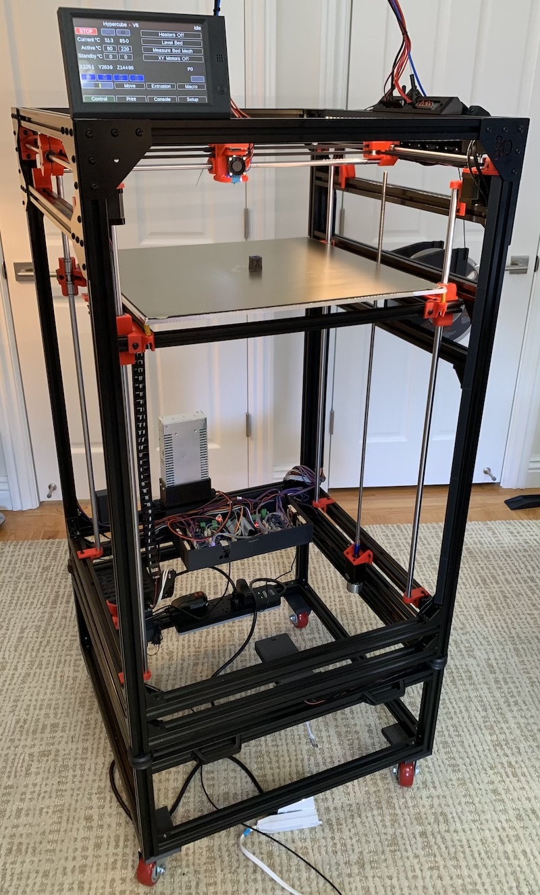

# Hypercube Evolution + Duet Ethernet Configuration Files
These files are for a Hypercube Evolution printer controlled by a Duet Ethernet. A Duex 5 expansion board is used to support all of the hardware associated with the machine.



### Machine Features via Duet
- 500mm x 500mm x 750mm build size.
- 5 BMG extruders.
- Handles up to 15 tool heads, each with a unique ID# encoded using 4 endstop inputs.
- Tested and placeholder code currently for:
  - V6 (tested)
  - Volcano (tested)
  - Kraken
  - Diamond Fullcolor water cooled
  - Super Volcano (tested)
  - Zesty Nimble
  - Titan Aero (tested)
  - Laser Engraver
- Multiple cooling options
  - Tool head mounted fan
  - Frame mounted water pump and radiator for water cooled heads.
- Orion Piezo sensor used for Z axis endstop.
- Two independent Z axis steppers.
- Z steppers have physical brakes controlled by a small circuit plugged into the CONN_LCD connector emulating a stepper on channel 11.
- Sensorless homing used for X and Y axis. Performs "fast then slow" homing.
- Purge bucket mounted to the frame, controlled by a servo.
- Configured for multiple filaments with separate config files.
- Physical button mounted to frame to stop filament feed during filament loading.

### Additional Features
- 5 filament sensors connected through an Arduino that maps the active filaments for the current tool head. Allows use of a single input for filament monitoring.
- Arduino with a "time of flight" distance sensor below the bed which controls a vertical light strip running down the frame to only illuminate LEDs above the bed surface. Tracks as the bed moves down.
- Raspberry Pi 3 with Camera that connects to the Duet via Telnet.
  - Watches the printer status, starts recording images when a print begins.
  - Takes a new picture at each layer change.
  - On completion:
    - Uses FFMPEG to create a movie.
    - Sends an SMS via Twilio to indicate completion.
    - Sends an email with the last recorded image.
- Main frame sits on top of a 12" tall cart made of 3030 extrusion.
  - Sorbothane pads virtually eliminate vibration transmitted down to floor.
  - 3" wheels allow easy access to all parts of the machine.

## Tool IDs
0000 - No Tool
0001 - V6
0010 - Volcano
0011 - Laser
0100 - Kraken
0101 - Zesty
0110 - Super Volcano
0111 - invalid
1000 - Diamond Fullcolor
1001 - Titan Aero
1010 - invalid
1011 - invalid
1100 - invalid
1101 - invalid
1110 - invalid
1111 - Nozzle Setup

## Macros
- purge\_and\_prepare.g - Purge bucket procedure
- bucket\_retract.g - Retract purge bucket
- bucket\_extend.g - Extend purge bucket
- home\_and\_level.g - wait for temp
- present\_print.g - Final move to present Print
- extrude\_load.g - drive virtual axis with buttons
- extrude\_unload.g - unload filament

## Slicer Settings
### Start Code for Slicer
```
G21 ; Set metric values
T0 ; select tool 0  
G10 S140 ; preheat extruder not enough to melt filament  
M140 S[bed0_temperature] ; set bed temp no wait  
M98 P"/macros/home_and_level.g"  
M98 P"/macros/purge_and_prepare.g"  
```

### Ending Code for Slicer
```
G10 S0 ; turn off extruder  
M140 S0 ; turn off bed  
M106 S0 ; fan off  
M98 P"/macros/present_print.g"  
M0 ; finish  
```

### Settings for S3D for Firmware Retraction
These two settings are a bit of a hack. They generate easily recognized gcodes which are translated by Simplify3D with the lines below into the proper gcodes for firmware retraction which is handled by the Duet. Using a small retraction distance doesn't confuse the speed color coding in Simplify3D's gcode viewer.
- Retraction Distance: 0.10mm  
- Retraction Speed: 66.6mm/s

### Script for S3D for Firmware Retraction
Note that the values above are mm/s, the values in the gcode are mm/min.
```
{REPLACE "G1 E-0.1000 F3996" "G10"}  
{REPLACE "G1 E0.0000 F3996" "G11"}
```

## Development tools
- gcode was all developed on a Mac using the Atom IDE.
- Git is used to manage changes.
- Files are pushed to the Duet using GoodSync.
  - Originally was using a Duet Wifi but it seemed to have issues with the dense Wifi environment it was in (my laptop can see 96(!) base stations within range). This is in a house in SF with several neighbors with mesh networks installed.
  - Duet Ethernet is much more reliable for me.
  - GoodSync can be set to use file checksums to verify differences. It was reliable even with the Duet Wifi's issues.
  - Termius is used for Telnet connections directly to the Duet.
